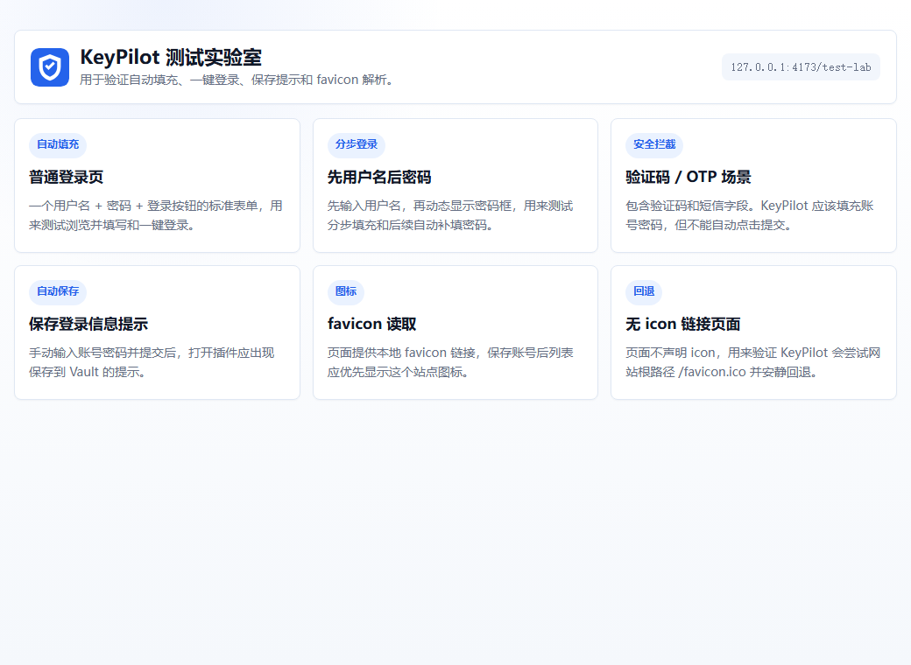

<p align="center">
  
</p>

<h1 align="center">KeyPilot / 钥航</h1>

<p align="center">
  Local-first password manager, autofill, identity form filling, and one-click login extension for Chromium browsers.
</p>

<p align="center">
  <a href="#english">English</a>
  ·
  <a href="#简体中文">简体中文</a>
  ·
  <a href="https://github.com/tigersvip/keypilot-extension/releases">Releases</a>
  ·
  <a href="SECURITY.md">Security</a>
</p>

<p align="center">
  
  
  
  
</p>

<p align="center">
  
  
  
  
  
</p>

<p align="center">
  
</p>

> Beta preview: KeyPilot is not independently security audited yet. Test carefully before storing important credentials.

---

## English

KeyPilot is a local-first browser extension for password management, autofill, identity/profile form filling, password generation, and one-click login. It is designed for Chrome, Edge, and other Chromium-based browsers.

The product principle is simple: credentials, generated passwords, and structured form-fill profiles stay on the user's machine inside an encrypted local Vault. KeyPilot does not depend on cloud sync, does not call third-party logo APIs, and should not send saved domains or private form data to external services.

### Highlights

| Area | What KeyPilot does |
| --- | --- |
| Encrypted Vault | Stores credentials and profiles locally using a master-password-protected Vault. |
| One-click login | Opens a site, fills username and password, and attempts a safe submit when possible. |
| Inline autofill | Shows a lightweight KeyPilot menu next to login and form fields. |
| Password generator | Supports length, uppercase, lowercase, numbers, symbols, excluded characters, and required characters. |
| Credential import/export | Imports RoboForm, Chrome, Edge, and generic CSV; exports selected credentials to RoboForm CSV. |
| Identity profiles | Imports Excel, CSV, and `.kpfill` profiles for structured form filling. |
| Local favicon | Reads site icons from the page or `/favicon.ico`; never uses Google Favicon or Clearbit Logo APIs. |
| High security mode | Disables unlocked Vault/session key caching for stricter local security. |

### Why local-first

- No remote account is required.
- Saved credentials are not uploaded by the extension.
- Vault data stored in `chrome.storage.local` is encrypted.
- The master password is not persisted.
- Favicon handling avoids third-party logo services.
- Sensitive exports are explicit and user-controlled.

### Install

#### Option 1: Load unpacked extension

```bash
npm install
npm run build
```

Then open:

- Chrome: `chrome://extensions/`
- Edge: `edge://extensions/`

Enable Developer mode, choose **Load unpacked**, and select the generated `dist/` folder.

#### Option 2: Release package

Download from [Releases](https://github.com/tigersvip/keypilot-extension/releases):

- `keypilot-extension-v1.1.zip`: recommended for local testing. Extract it and load the extracted folder.
- `keypilot-extension-v1.1.crx`: packaged CRX build. Some browsers may block direct installation of external CRX files.

### Development

```bash
npm install
npm run build
npm run lab
```

If PowerShell blocks `npm.ps1`, use:

```bash
npm.cmd install
npm.cmd run build
npm.cmd run lab
```

The local test lab runs at:

```text
http://127.0.0.1:4173/test-lab/
```

### Project structure

```text
.
├── public/                 # manifest, icons, and local test pages
├── src/
│   ├── background/         # Manifest V3 service worker
│   ├── content/            # form detection, inline menu, autofill
│   ├── options/            # standalone settings page
│   ├── popup/              # browser toolbar popup
│   ├── shared/             # crypto, Vault, import/export, matching
│   └── vault/              # full Vault management page
├── popup.html
├── options.html
├── vault.html
└── vite.config.ts
```

### Tech stack

- Manifest V3
- React 18
- TypeScript
- Vite
- Web Crypto API
- Chrome Extension APIs

### Security model

KeyPilot handles sensitive user data. The current model is:

- PBKDF2 + SHA-256 for key derivation.
- AES-GCM for Vault encryption.
- Encrypted Vault data is stored in browser extension storage.
- Plain Vault data only exists in an unlocked runtime session.
- High security mode can disable unlocked session caching.
- Exported CSV and `.kpfill` files may contain plaintext sensitive data and should be handled carefully.

Read [SECURITY.md](SECURITY.md) before reporting vulnerabilities.

### Current limitations

- Beta preview, not security-audited.
- Website login flows vary widely; one-click login compatibility still needs more rules and testing.
- No cloud sync, team sharing, passkey support, production TOTP management, or breach monitoring yet.
- Firefox support has not started.

### Roadmap

- Larger site-rule library and auto-login repair flows.
- TOTP management and safer OTP field detection.
- Passkey / WebAuthn research.
- More granular export permissions and encrypted sharing.
- Automated tests and browser compatibility matrix.
- Chrome Web Store release assets and privacy documentation.

### Contributing

Issues, compatibility cases, site rules, documentation improvements, and pull requests are welcome. Please read [CONTRIBUTING.md](CONTRIBUTING.md).

### License

MIT License. See [LICENSE](LICENSE).

---

## 简体中文

钥航 KeyPilot 是一个本地优先的浏览器密码管理、自动填表、身份资料填写和一键登录插件，适用于 Chrome、Edge 以及其他 Chromium 内核浏览器。

它的核心目标很明确：账号、密码、生成密码和结构化填表资料只保存在本机加密 Vault 中，不依赖云端同步，不调用第三方 Logo / Favicon 服务，不把用户保存的网站域名或资料发送给外部服务。

### 功能亮点

| 模块 | KeyPilot 支持 |
| --- | --- |
| 本地加密 Vault | 使用主密码保护本地 Vault，账号和资料加密保存。 |
| 一键登录 | 打开网站、填写用户名和密码，并在安全条件满足时尝试点击登录按钮。 |
| 网页内快捷菜单 | 在登录框和表单字段旁显示轻量 KeyPilot 菜单。 |
| 密码生成器 | 支持长度、大小写、数字、符号、排除字符、必须包含字符。 |
| 账号导入导出 | 支持 RoboForm、Chrome、Edge、通用 CSV 导入；支持勾选指定账号导出 RoboForm CSV。 |
| 身份资料填表 | 支持 Excel、CSV、`.kpfill` 导入结构化资料，用于网页批量填表。 |
| 本地图标策略 | 优先读取网页声明的 icon 或 `/favicon.ico`，不调用 Google Favicon / Clearbit Logo API。 |
| 高安全模式 | 关闭解锁 Vault 和 AES 密钥的会话缓存，降低本机缓存暴露面。 |

### 为什么本地优先

- 不需要远程账号。
- 插件不会上传保存的账号密码。
- `chrome.storage.local` 里只保存加密后的 Vault。
- 主密码不会持久化保存。
- 网站图标不使用第三方 Logo 服务。
- CSV / `.kpfill` 导出由用户显式选择和确认。

### 安装方式

#### 方式一：加载已解压扩展

```bash
npm install
npm run build
```

然后打开：

- Chrome：`chrome://extensions/`
- Edge：`edge://extensions/`

开启“开发者模式”，点击“加载已解压的扩展程序”，选择生成的 `dist/` 目录。

#### 方式二：下载 Release 包

在 [Releases](https://github.com/tigersvip/keypilot-extension/releases) 下载：

- `keypilot-extension-v1.1.zip`：推荐测试使用。解压后加载目录。
- `keypilot-extension-v1.1.crx`：CRX 打包版本。部分浏览器可能限制直接安装外部 CRX。

### 本地开发

```bash
npm install
npm run build
npm run lab
```

如果 PowerShell 阻止 `npm.ps1`，可以使用：

```bash
npm.cmd install
npm.cmd run build
npm.cmd run lab
```

测试实验室地址：

```text
http://127.0.0.1:4173/test-lab/
```

### 项目结构

```text
.
├── public/                 # manifest、图标、本地测试页面
├── src/
│   ├── background/         # Manifest V3 service worker
│   ├── content/            # 表单识别、内联菜单、自动填充
│   ├── options/            # 独立设置页
│   ├── popup/              # 浏览器工具栏弹窗
│   ├── shared/             # 加密、Vault、导入导出、域名匹配等共享逻辑
│   └── vault/              # 后台 Vault 管理页
├── popup.html
├── options.html
├── vault.html
└── vite.config.ts
```

### 技术栈

- Manifest V3
- React 18
- TypeScript
- Vite
- Web Crypto API
- Chrome Extension APIs

### 安全模型

KeyPilot 会处理敏感数据，目前安全模型如下：

- 使用 PBKDF2 + SHA-256 派生密钥。
- 使用 AES-GCM 加密 Vault。
- 浏览器扩展存储中保存的是加密 Vault。
- 明文 Vault 只存在于解锁后的运行时会话。
- 高安全模式可关闭解锁会话缓存。
- 导出的 CSV 和 `.kpfill` 可能包含明文敏感数据，请谨慎保存和传输。

如需报告安全问题，请先阅读 [SECURITY.md](SECURITY.md)。

### 当前限制

- 当前仍是 Beta Preview，尚未经过第三方安全审计。
- 真实网站登录流程差异很大，一键登录兼容性还需要持续积累规则。
- 暂无云同步、团队共享、Passkey、正式 TOTP 管理、泄露监控。
- Firefox 适配尚未开始。

### 后续规划

- 更完整的站点规则库和自动登录失败修复。
- TOTP 管理和更安全的验证码字段识别。
- Passkey / WebAuthn 能力调研。
- 更细的导出权限和加密分享流程。
- 自动化测试和浏览器兼容性矩阵。
- Chrome Web Store 发布材料和隐私说明。

### 贡献

欢迎提交 issue、兼容性案例、站点规则、文档改进和 pull request。请先阅读 [CONTRIBUTING.md](CONTRIBUTING.md)。

### License

MIT License. See [LICENSE](LICENSE).
